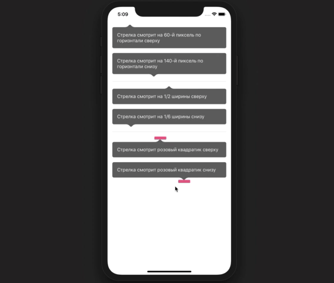

# ArrowContainerView




Конфигурация производится с помощью 1 из 3 вариантов:

```
public enum ArrowViewXAnchor {
    /** Указывает смещение в пикселях от левого края. На эту точку будет смотерть стрелка.
     Подходит, например, когда стрелка должна указывать на barButton */
    case toOffset(xOffset: CGFloat, placement: ArrowViewPlacement)
    
    /** fraction - это пропорция от собственной ширины, на которую будет ровняться стрелка.
     Например 1/2 - это середина. Дипазон значений от 0 до 1.
     Подходит для случаев, когда есть несколько заранее известных положений стрелки */
    case toSelfWidth(ratio: CGFloat, placement: ArrowViewPlacement)
    
    /** Указывается view, на центр которой по оси x будет ровняться стрелка.
     Параметр placement будет высчитан автоматически */
    case toXCenterOf(targetView: UIView)
}
```
